# bike_sharing_ml
Predict hourly bike rentals using historical data from the UCI Bike Sharing Dataset.  
This project demonstrates **EDA, preprocessing, feature engineering, multiple ML models, and model evaluation** for a regression problem.

---

## Dataset
- **Source:** [UCI Bike Sharing Dataset](https://archive.ics.uci.edu/ml/datasets/Bike+Sharing+Dataset)  
- **Columns include:** season, hour, temperature, humidity, weather, and bike rental counts.

---

## Project Workflow

1. **Exploratory Data Analysis (EDA)**
   - Analyzed bike rental trends over hours, days, seasons
   - Observed relationships between temperature, weather, and rental counts
   - Detected peak hours and seasonal patterns

2. **Preprocessing**
   - Handle missing values 
   - Scale numeric features (temperature, humidity, windspeed)
   - Encode categorical variables (season, weather)
   - Generate cyclical features for hour and day of week

3. **Modeling**
   - Linear Regression
   - Random Forest Regressor
   - Gradient Boosting Regressor
   - XGBoost Regressor
   - Neural Network (MLPRegressor)

4. **Evaluation Metrics**
   - RMSE
   - MAE
   - R²
   - MAPE

5. **Visualizations**
   - Actual vs Predicted plots for each model
   - Feature importance for tree-based models
   - Distribution of rentals over hours, seasons, and weather conditions

---

## Plots

**Correlation Heatmap of Features**
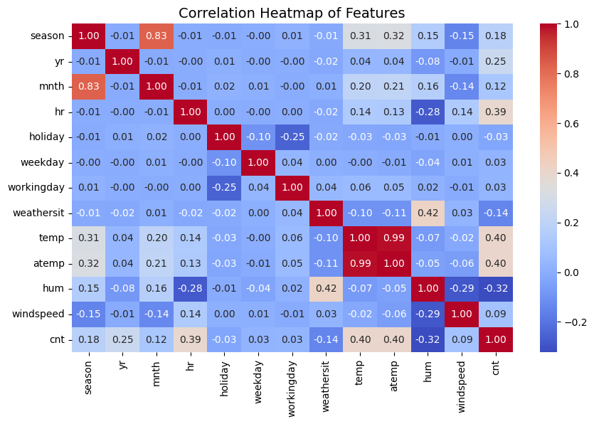

**Distribution of Bike Rental Counts**
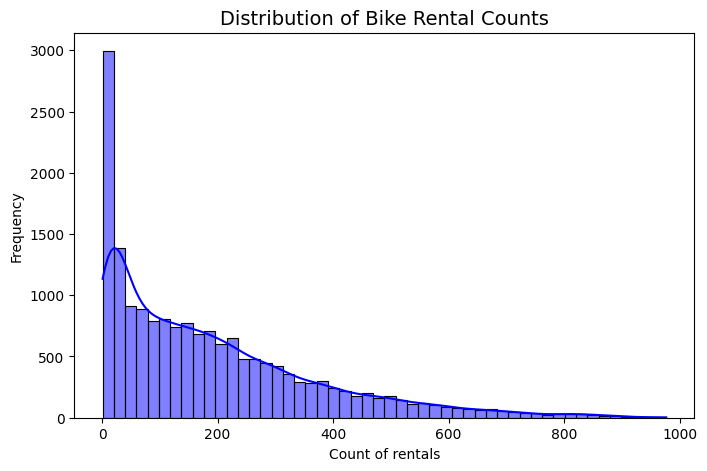

**Bike Rentals by Season**
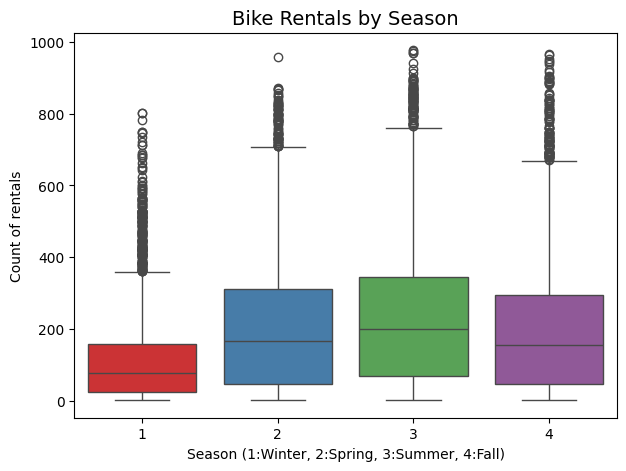

**Hourly Bike Rentals(Workingday vs Non-Workingday)]**
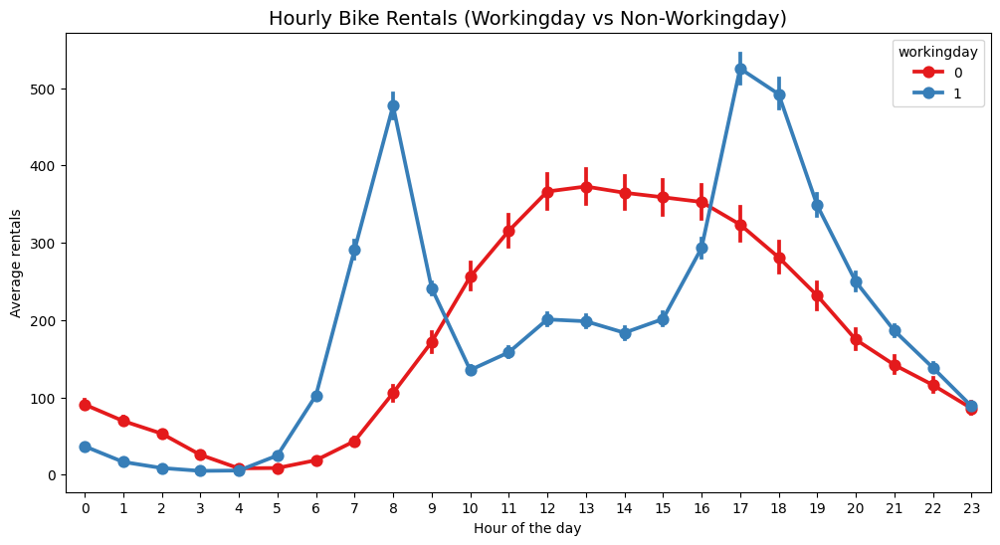

**Bike Rentals by Weather Situation**
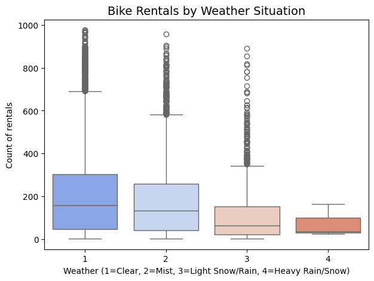

**Temperature vs Bike Rentals**
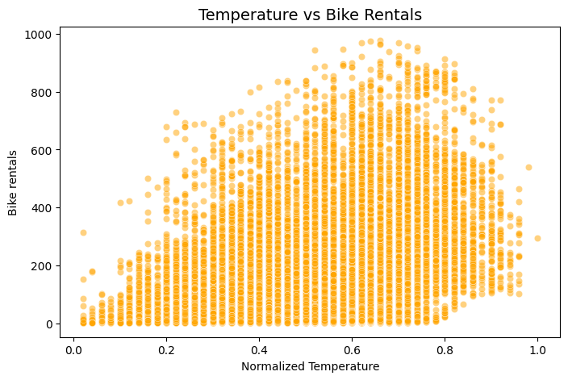

**Linear Regression: Actual vs Predicted**
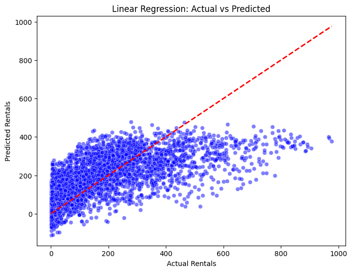

**Random Forest: Actual vs Predicted**
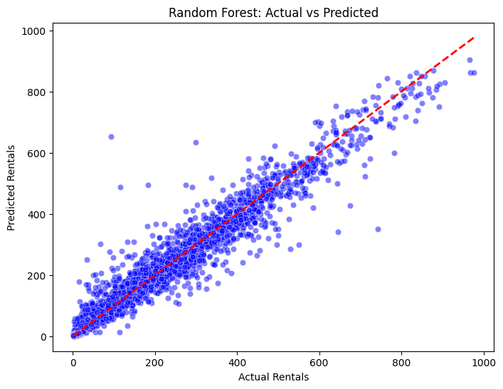

**Gradient Boosting: Actual vs Predicted**
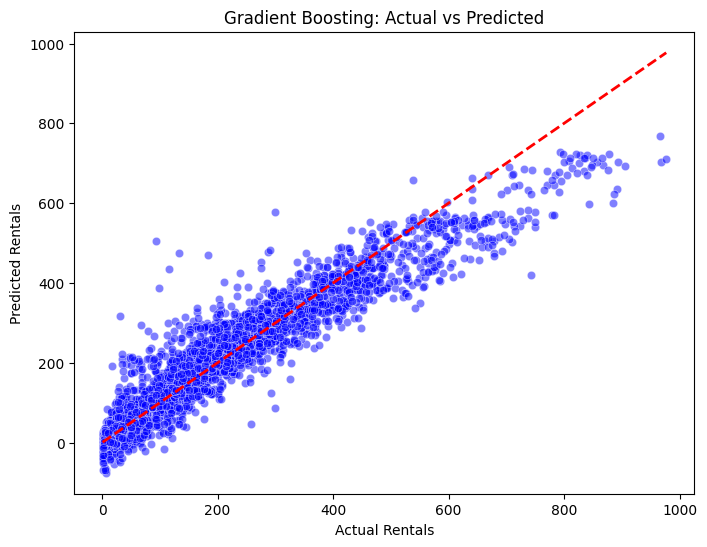

**XGBoost: Actual vs Predicted**
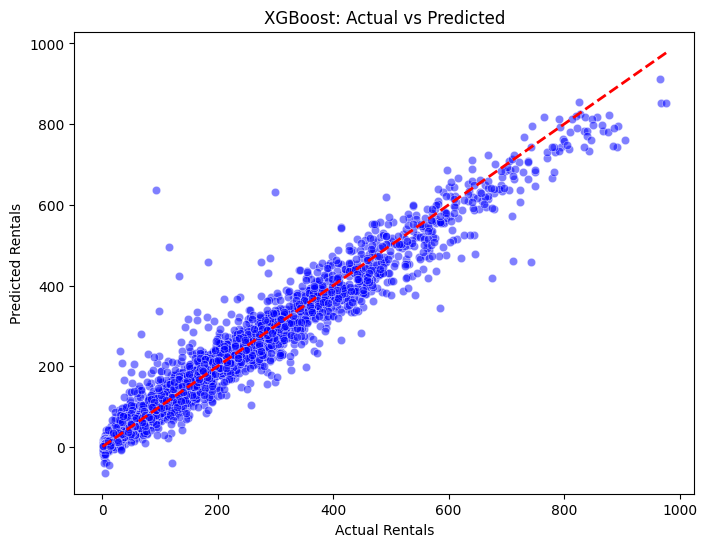

**Neural Network: Actual vs Predicted**
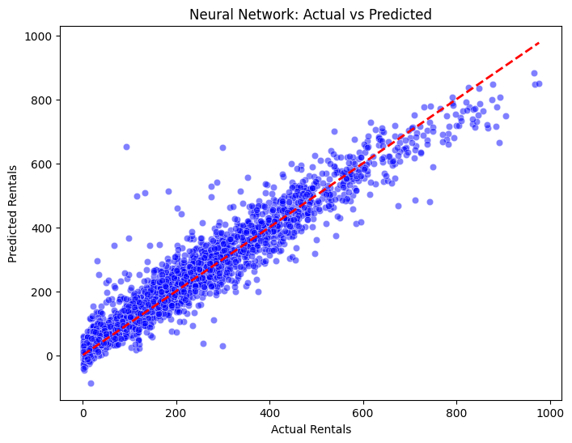

**Performance Comparison of all Models**
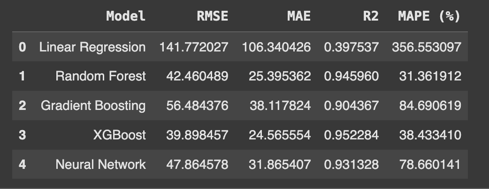

---

## Key Insights

1.**Linear Regression**

  - Worst performance (R² ≈ 0.40, very high RMSE & MAE).

  - Fails to capture nonlinear relationships in bike rentals.

2.**Tree-based models (Random Forest, Gradient Boosting, XGBoost)**

  - XGBoost slightly outperforms others on R² and RMSE.

  - Random Forest is very strong too (slightly higher RMSE than XGBoost).

  - These models handle nonlinearities and interactions between features (hour, temperature, weather) very well.

3.**Neural Network**

  - Decent performance (R² ≈ 0.93).

  - RMSE & MAPE higher than XGBoost/Random Forest → may need more tuning or feature scaling adjustments.

4.**MAPE insights**

  - Linear Regression has huge MAPE (~356%) → predicts poorly for small or extreme rental counts.

  - Random Forest & XGBoost have low MAPE (~31–38%) → predictions are relatively accurate.

  - Gradient Boosting & Neural Network have higher MAPE (~78–85%) → may struggle with extremes.

---

## Summary

Among all models tested for predicting bike-sharing demand, XGBoost and Random Forest performed best, achieving R² above 0.94, low RMSE (~40), and MAPE around 30–38%. Linear Regression underperformed due to its inability to capture nonlinear relationships. Neural Networks and Gradient Boosting showed decent performance but were less consistent for extreme demand values. Tree-based ensemble methods proved most effective for this real-world regression task

